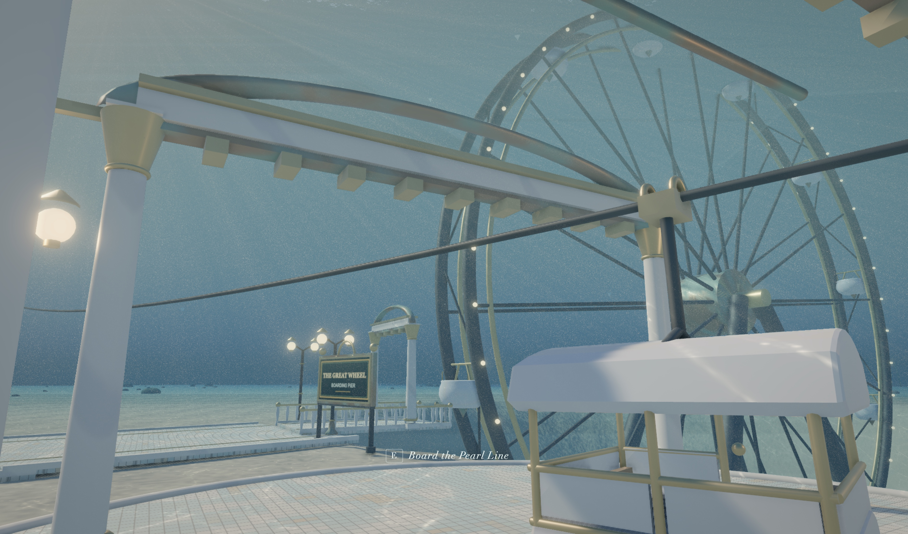

# The Pearl — Royal Pleasure Gardens Beneath the Sea

For one golden day, you are the only guest in the most beautiful place humans ever built — and they built it at the bottom of the sea.

***See live game at: https://pearl.scottsun.io***

Descend past the waterline and step onto the sunlit reef where a visionary founder raised a Belle Époque wonderland of glass domes, brass filigree, and white marble. Here the sea behaves like air — you simply walk the boulevards while rays and turtles drift overhead and light shafts rake across the mosaic. No crowds, no clocks, no fail states: you hold Golden Ticket No. 1, and the whole park is turning, chiming, and glittering just for you. Roam it, ride it, and let it surprise you.

## Attractions

- **The Descent Bell** — Board a glass diving bell and fall through the waterline in one unbroken breath: sky, then foam, then blue, then the whole park blazing to life below you.
- **The Grand Atrium** — A cathedral of glass welcomes you as a brass machine punches your golden ticket and hands you a pocket model of the park to carry.
- **The Esplanade** — Stroll a barrel-vaulted glass boulevard of arcade shopfronts and swaying banners while a manta glides across the vault overhead.
- **Tidal Court** — The beating heart of the park, where the Bubble Fountain choreographs columns of light-threaded air over the lagoon in a show worth waiting for.
- **The Great Wheel** — Ride a nautilus-shell gondola forty meters up until its crest breaks the surface, giving you a few sunlit seconds of open sky before you sink back into blue.
- **The Torrent** — Strap into a brass torpedo coaster that launches off the shelf edge into open void, threads a shipwreck, and breaches the waves before racing home.
- **Menagerie Gardens** — An inverted zoo of flower-filled greenhouses, drifting moon-jelly cloisters, a turtle lagoon you can feed, and an overlook where the whale passes shadow-first.
- **The Midway** — A boardwalk of warm bulbs and calliope rag: ride the Carrousel des Abysses, test your aim on real physics carnival games, and hold an ice cream that does nothing but slowly melt.
- **Grotto of Pearls** — Drift by boat through dark caverns of bioluminescent gardens, a shell-organ sculpture, and a pearl treasury that glows like a galaxy.
- **The Pearl Line** — Glide fourteen meters above it all on a brass cable gondola — transit that is secretly the grand aerial tour.
- **Texture Rooms** — Linger at the Café Méduse terrace, wander the founder's museum, or recline beneath the Observatory dome built for nothing but watching the Silver Ceiling shimmer.
